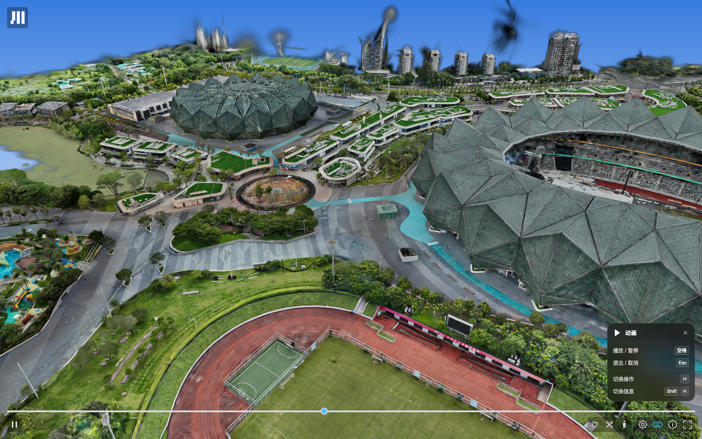
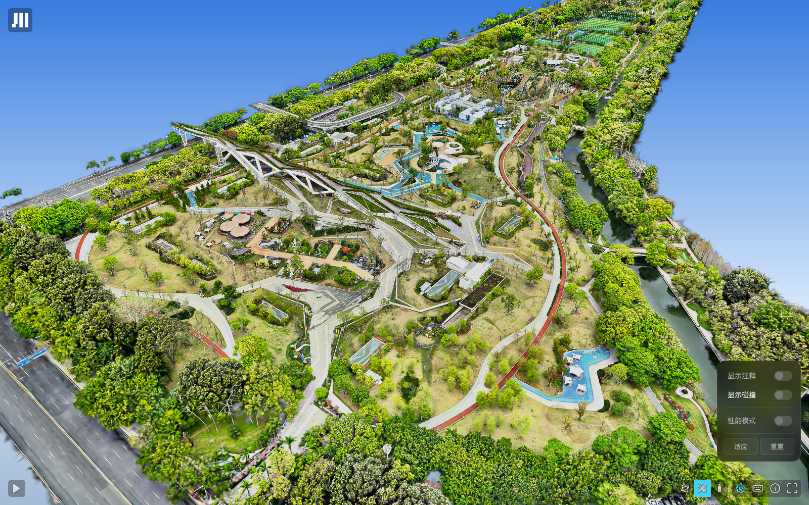
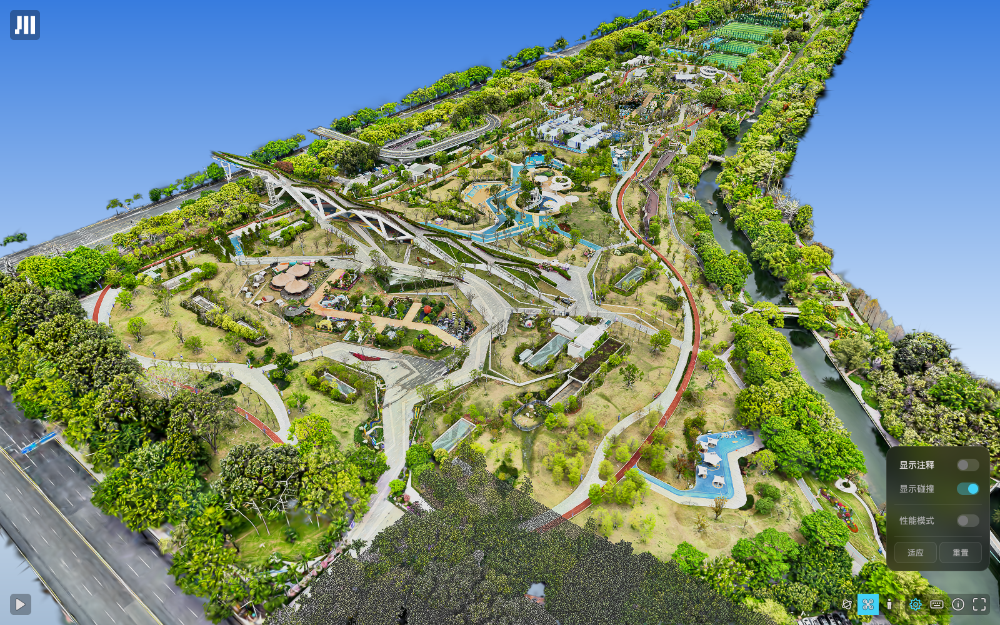

# Tiled voxel collision: public deployment evidence

Observed on **2 October 2026, approximately 22:42–22:50 Asia/Shanghai** using a separate, headed Playwright Chromium session on macOS, with a 1600 × 1000 viewport. The browser user agent reports Chrome 154.0.0.0. Both pages report **Metaflow Viewer 5.20.1, SuperSplat 1.35.2, PlayCanvas Engine 2.22.4 (b5b9839), renderer: WebGPU** in the console.

These are screenshots of the existing public MetaFlow deployment, which demonstrates the motivation and prior integration. They are **not acceptance tests of the proposed upstream implementation**, nor a claim that all tiles or walking routes work. No full source scene was downloaded for redistribution, and no production content was changed.

## Scenes and generation parameters

| Scene | Public demo | Manifest entries | Voxel resolution | Tile width | Overlap |
| --- | --- | ---: | ---: | ---: | ---: |
| Dayun | [Open Dayun](https://metaflow.shuang-su.com/shenzhen/dayun) | 293 | 0.08 m | 64 m | 8 m |
| Bijiashan Park | [Open Bijiashan Park](https://metaflow.shuang-su.com/shenzhen/bijiashan) | 320 | 0.08 m | 64 m | 8 m |

The entry counts, resolution, tile width and overlap were read from the deployed manifests. Bijiashan also declares `opacityThreshold: 0.2` and `rotation: "0,0,-180"`; the Dayun manifest does not declare an opacity threshold. The recorded generation setting supplied with the project is 0.2 for both. These historical datasets use MetaFlow's coordinate adaptation (`metaflow-rz180`); they must not be treated as unmodified fixtures for the proposed official-world-coordinate format.

- [Dayun manifest](https://metaflow.shuang-su.com/data/Shenzhen/250917%20Dayun/tiled-voxel/voxel-tiles.json)
- [Bijiashan manifest](https://metaflow.shuang-su.com/data/Shenzhen/260326%20Bijiashan%20Park/derived_lcc_tiled_full_rot0_0_m180_xz_v2.4.0_lod1_r0.08_a0.20_tile64_o8/voxel-tiles.json)

## Screenshots

Dayun, default animated overview after scene loading:

Bijiashan, paused view after switching to Fly; collision display is off in the settings panel:

Bijiashan at the same camera position with **显示碰撞 / Show collision** enabled. The dark stippled geometry across the foreground is the collision overlay. This shows an active subset, not all 320 manifest entries. The screenshot does not establish global alignment or collision correctness.

## Reproducing the observed UI

1. Open either public demo in a WebGPU-capable desktop browser and allow the default scene to load. The demo starts its camera animation automatically and loads nearby collision tiles without a `collision` query parameter.
2. Press **Space** to pause the animation. In the bottom-right camera group, click the drone icon (**飞行相机 / Fly camera**) to leave animation mode. The person icon is disabled during animation and became available after switching to Fly in this session.
3. Click the bottom-right gear and enable **显示碰撞 / Show collision**. On Bijiashan, **显示注释 / Show annotations** can also be disabled to get the uncluttered screenshots above. Toggle Show collision off/on to compare the same view.
4. Click the person icon to enter **行走模式 / Walk mode**; press **Esc** to exit walking. The help panel documents **W/A/S/D** for movement, **Shift/Ctrl** for fast/slow movement, **R** to reset the camera, and **H** to show/hide controls.

Only the settings toggle is the verified collision-display interaction here. No keyboard shortcut for collision display is claimed.

## Observed limitations and failures

- Both Gaussian splat scenes rendered, and both downloaded their tiled collision manifests and nearby `walk.voxel.json` / `walk.voxel.bin` resources with HTTP 200 responses.
- The collision display toggle produced visible stippled collision geometry in both scenes. Bijiashan's on/off screenshots above provide the clearest same-camera comparison.
- **Walking is not validated by this session.** Entering Walk from the tested elevated viewpoints in both scenes eventually left a sky-only view. No claim is made about the cause, successful landing, sustained walking, or seam behavior. The screenshots showing an enabled Walk icon must not be presented as evidence of successful traversal.
- Bijiashan actually requested `tiles/x12_z7/walk.voxel.json` and received **HTTP 404**, followed by the viewer warning `Failed to load voxel tile x12_z7`. Separate HEAD checks confirmed that both `x12_z7` and `x0_z0` are listed in the manifest but their referenced voxel metadata URLs return 404. The project's prior generation records identify these as empty tiles retained in the historical manifest; that historical classification is separate from this browser observation. No exhaustive check of all 320 entries was performed.
- Dayun logged `Invalid SOG metadata` for its `1_144/meta.json`, reporting missing texture metadata. This is a splat scene resource error, separate from the observed successful voxel tile requests.
- Bijiashan also logged transient `ERR_CONNECTION_CLOSED` errors and retries for four `2_28/*.webp` splat resources. This session does not establish whether every retry ultimately succeeded.
- These existing deployment limitations motivate explicit empty-tile omission, surfaced load failures, and conservative walking readiness in the proposed implementation. They do not establish that the upstream draft has fixed the deployed data.

The contribution should link this evidence alongside the relevant upstream discussions, including [splat-transform #253](https://github.com/playcanvas/splat-transform/issues/253) and [#343](https://github.com/playcanvas/splat-transform/issues/343). Any current-version reproduction for those issues should be reported separately with its exact command and version.
