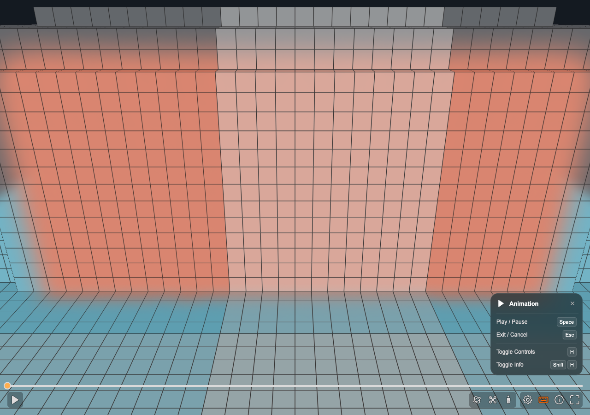
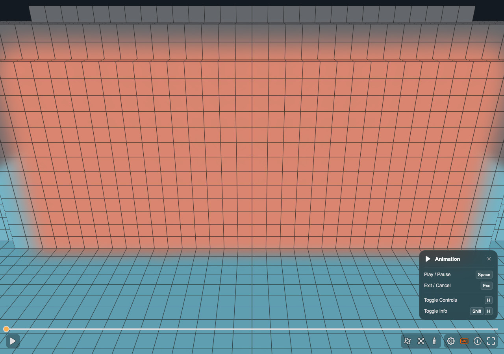
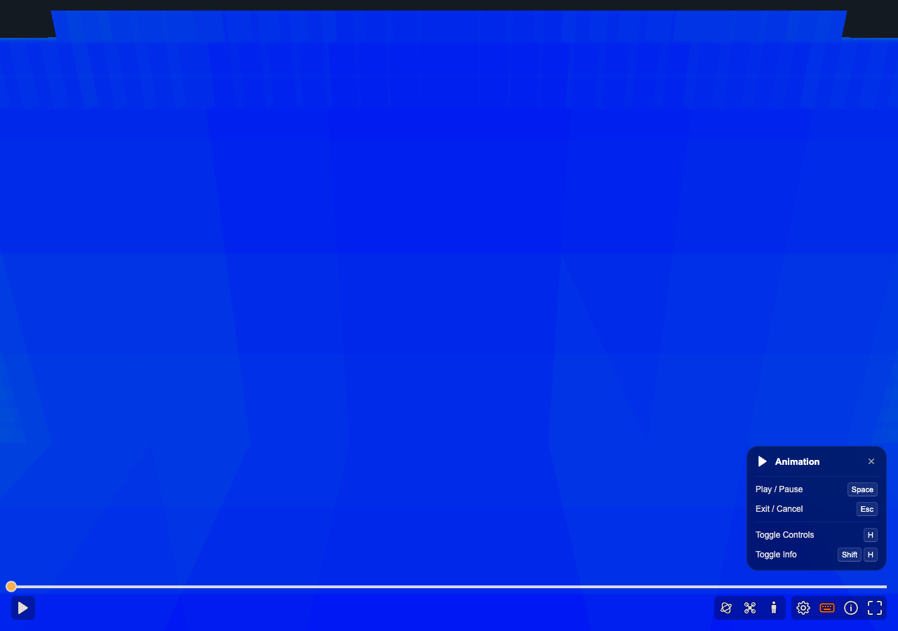

# Upstream draft validation — 2 October 2026

These results concern the new upstream contribution, separate from the historical MetaFlow deployment screenshots in the [main evidence record](README.md).

| Component | Official base | Tested feature commit |
| --- | --- | --- |
| splat-transform | 435b972a97a278c655d8f7015b1355215cba0d71 (3.9.0) | 9224b722107ae159c2a5cc7845d3bb5169a52698 |
| supersplat-viewer | cd0e316e397929ffa87abd4833f73f8a0bd1fd2b (1.37.0) | 657f1d3 (feature branch) |

## Automated checks

All commands ran on Node **24.21.0** on macOS.

- Generator: `npm test` passed (851 passed, 1 skipped); explicit `TEST_WEBGPU=1 node --import tsx --test --test-force-exit test/voxel-tiles.test.mjs` passed 12/12 tests. Formatting, lint, typecheck, publint and Typedoc passed. Typedoc emitted 13 pre-existing warnings; publint emitted an existing metadata suggestion.
- Generator assertions cover decoded core occupancy against monolithic output, rotated cross-boundary Gaussians, zero-overlap seams, shared grid alignment, transforms, empty tiles/gaps, capacities, failed reads and failed binary writes. A final fixture-only enlargement was followed by another 12/12 CPU/GPU run.
- Viewer: build, typecheck, formatting, lint, publint and all **64/64 unit tests** passed. Behavior tests include request deduplication, neighborhood changes, delayed results, eviction/cancellation, retries, destroy, absent coverage, occupied overlap union, legacy format loading, walking safeguards and overlay allocation/disposal.

## Actual browser integration

A headed Chrome session at 1280 × 900 on macOS loaded the [2,220-Gaussian synthetic fixture](repro/) generated by the new writer. The browser reported SuperSplat Viewer 1.37.0 / Engine 2.23.0. A small local harness used the public `createViewer`, observable `state`, `toggleWalk`, `setMoveInput` and `destroy` APIs; the unchanged public HTML query-parameter entry point was loaded separately too.

- The manifest contains six standard voxel 1.1 tiles. At the initial camera `[-2, 2, 0]`, four nearby JSON/bin pairs loaded successfully; the two farther tiles were not eagerly requested. Moving to the next core loaded its neighbors.
- On **WebGPU**, walk became available, settled on the floor, crossed the X seam at `-0.4`, and stopped at the wall at approximately `[0.20006, 1.95, 0]` after forward input. The wall is centered at X `0.8`; the camera did not pass through it.
- On **WebGL2**, the same traversal stopped at the same wall position. `walkAllowed` remained true and `hasCollisionOverlay` was false, preserving the existing backend behavior.
- The **single-voxel comparison** rendered its overlay and stopped at the wall with the same movement input.
- WebGPU overlay and heatmap rendered. Hiding the overlay and destroying the viewer completed without console errors or warnings; destruction left zero canvas elements. Automated lifecycle tests verify tile and GPU resource cleanup, since a screenshot cannot establish GPU allocation lifetime.

Tiled collision overlay at the initial camera:

Single-voxel comparison at the same initial camera:

Heatmap of the active tiles:

## Limits of this validation

This fixture establishes a working producer/consumer path and one seam/wall traversal, not exhaustive walking validation of the original large scenes. Slow/failing requests, retries, stale results and missing coverage were exercised in deterministic behavior tests, not by claiming a full live-network stress test.

The debug viewer composites one independently ray-marched result per tile. Overlap can be brighter, and farther-tile geometry is not globally depth-merged behind nearer tiles. This is a documented draft limitation of visualization; collision queries combine occupied voxels as a union.

The generator still performs repeated source scans and only supports surface voxelization. In-place replacement is not transactional, and eager source decoders or prior actions can retain scene memory. The 149M-Gaussian source in [#343](https://github.com/playcanvas/splat-transform/issues/343) was not rerun as part of these checks. No whole-scene memory/performance improvement measurement is claimed here.
